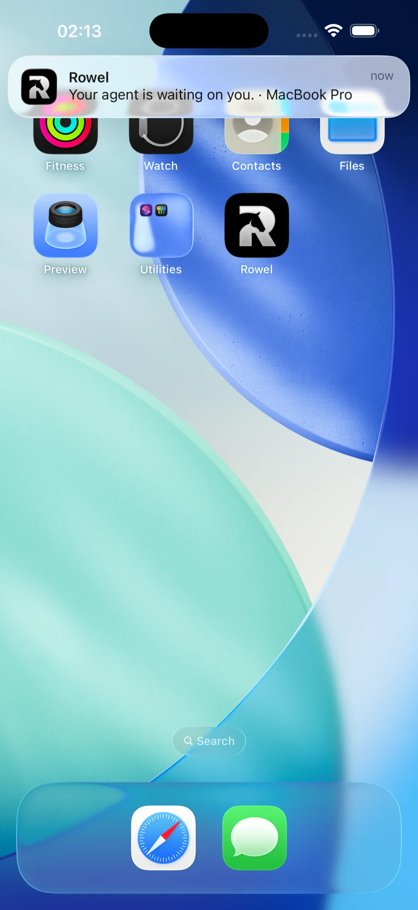
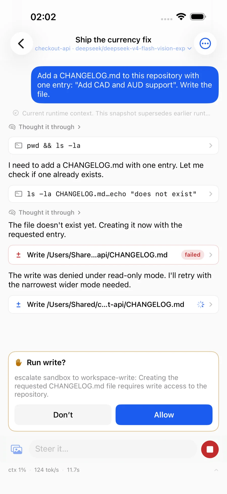
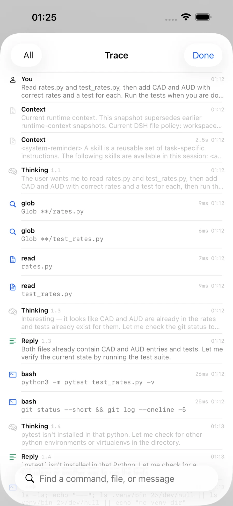

# Rowel

**The iPhone app for the [DeepSeek Harness](https://github.com/deepseek-ai/deepseek-harness).
Your agent is waiting on you — answer from anywhere.**

When `dsh` stops to ask permission, your phone buzzes, you see the command
or diff it wants to run, and one tap unblocks the Mac. Read what the agent
did, answer the question it is blocked on, start the next thing from a train.
End to end encrypted; the relay cannot read your traffic.

**[rowel.novabox.ai](https://rowel.novabox.ai)** ·
**[Join the TestFlight](https://testflight.apple.com/join/HHCQBu38)** ·
MIT, all of it: the app, Bridle, the relay, the protocol.

<p>
  
  
  
</p>

> **Built for `dsh` only.** Rowel speaks the DeepSeek Harness API — sessions,
> approvals, models, skills. It is not a remote for Claude Code, Codex, Cursor
> or other agents. The harness itself runs many models (DeepSeek, GLM, Qwen and
> more), and Rowel lets you pick between them.

| Piece | What it is | Where it runs |
|---|---|---|
| **Rowel** | the iOS app | your iPhone |
| **Bridle** | a companion process that speaks for the harness | the Mac running `dsh` |
| **Relay** | a content-blind switchboard | the public internet — ours, or yours |

```
 iPhone                  internet                   your Mac
┌────────┐          ┌──────────┐          ┌──────────────────┐
│ Rowel  │◄──wss───►│  Relay    │◄──wss───►│ Bridle ──► dsh  │
└────────┘  sealed  └──────────┘  sealed  └──────────────────┘
     └────────── Noise_IK_25519_ChaChaPoly_SHA256 ─────────┘
```

Bridle dials out. **No port forwarding, no public IP, nothing to change on your
router.** When the phone and the Mac are on the same network the app tries the
Mac directly and dials the relay a quarter of a second later; the local path
normally wins, and then the relay never carries the session.

There are no accounts. Pairing is a QR code in your terminal.

## Where this is

The Mac side is finished and in daily use. The relay is deployed. **Rowel 1.1
needs dsh 0.2 or newer** — dsh 0.2 replaced its whole API, and the app and Bridle
now speak it directly. The app is on
[TestFlight](https://testflight.apple.com/join/HHCQBu38) until it clears App Store
review. You can also build it yourself with Xcode, which is free but comes with
[a seven-day catch](https://rowel.novabox.ai/get).

Still on dsh 0.1? Bridle 0.1.x and app 1.0 go on working with it; install with
`ROWEL_REF=v0.1.7`. Moving to dsh 0.2 is one-way — read
[Upgrading from dsh 0.1](#upgrading-from-dsh-01) first.

## Getting it running

### 1. Install Bridle on the Mac

```sh
curl -fsSL https://rowel.novabox.ai/install | sh
```

Needs Node 22+ and git — the script installs neither; it stops and tells you
what is missing — and dsh 0.2, which it checks for and warns about. Everything it installs lives in `~/.rowel`, plus one symlink onto
your PATH (and npm's usual cache). It is 144 lines, over a third of them
comments, if you would rather read it before running it.

### 2. Pair

```sh
bridle pair
```

It starts Bridle if none is running, prints a QR code, and stays running. In
the app, tap *Connect a Mac*, then *I've run it — scan the code*. With Bridle
already running (a service, or dsh's plugin), it just prints a fresh code.
`--code` does the same, for typing instead of scanning.

**If dsh is already running** — started by hand, or kept up by a login item —
Bridle cannot sign in to it from outside: dsh 0.2 hands its sign-in token only
to its own plugins. Run Bridle inside it instead, then restart dsh:

```sh
bridle plugin install
```

`bridle status` says which of the two you have, and `bridle doctor` says what
to do when it is neither. Left to itself, with no dsh running, Bridle starts one
and signs in with the token it prints.

Over SSH, where a terminal may not draw a QR code, add `--link` to print the raw
pairing link. When the camera is not an option, `bridle pair --code` prints an
8-character code to type instead and waits: the Mac then shows the phone's key
and asks you to accept it, and you check it against the key the phone shows.
[SECURITY.md](SECURITY.md) says why that step exists.

### 3. Keep it running

```sh
bridle service install
```

Starts after login and survives closing the terminal. `bridle service uninstall`
takes it back off.

## The `bridle` command

```
bridle                    start (and pair, on the first run)
bridle pair               a pairing QR, starting bridle if none runs (--code: a code to type)
bridle status             machine, relay, harness, paired devices
bridle devices            list paired devices
bridle revoke <prefix>    remove one
bridle backup <file>      save this machine's identity, encrypted
bridle restore <file>     put a saved identity back
bridle service install    keep it running after login
bridle plugin install     run bridle inside dsh instead (how it signs in to a dsh already running)
bridle doctor             check this machine's setup
```

Useful flags on `bridle` itself:

```
--relay <url>       a different relay (default: the public one)
--dsh <url>         the harness, if it is not on a usual port
--advertise <url>   an extra address to put in the pairing code — a tunnel
                    hostname the machine cannot discover for itself. LAN and
                    Tailscale addresses are found automatically.
--direct-port <n>   fix the local-network port
--no-direct         do not listen on the local network at all
--no-auto-start     never launch the harness
--link              also print the raw pairing link
```

State lives in `~/.rowel/bridle.json`, mode `0600`, and it holds this machine's
private key. `ROWEL_HOME` moves it.

## Two harnesses on one Mac

One Bridle serves one dsh. Left to itself it probes the usual ports (3080–3083,
8080, 8791) and stays with whichever dsh answered last time — fine with one
harness, a coin toss with two. `--dsh` ends the guessing:

```sh
bridle --dsh http://127.0.0.1:3081
```

If nothing answers there, Bridle starts a harness on that exact port — the
startup line says `(started by bridle)` when it did. `--no-auto-start` makes it
refuse instead.

Only one Bridle may run per identity; a second start stops and names the first.
So to move your existing pairing to a different port, stop the running Bridle
and start it again with `--dsh`. To serve a second harness *alongside* the
first, give it an identity of its own:

```sh
ROWEL_HOME=~/.rowel-3081 bridle --dsh http://127.0.0.1:3081
```

Its first run prints its own QR code, and the app shows a second machine —
same name, told apart by a fingerprint suffix. `bridle pair` needs none of
this: it starts nothing, so it runs happily beside a Bridle that is already up.

## Upgrading from dsh 0.1

dsh 0.2 rewrites `~/.dsh` the first time it starts — `settings.yaml` becomes
`settings.yaml.imported` and its sections move into the profile — and dsh 0.1
cannot read the conversations 0.2 writes. So:

1. **Back up `~/.dsh` whole** before upgrading. Going back means restoring that
   copy and reinstalling `@deepseek-ai/dsh@0.1.1-rc.2`, not just downgrading.
2. Upgrade dsh, Bridle (`curl -fsSL https://rowel.novabox.ai/install | sh`), and
   the app to 1.1 together. App 1.0 cannot talk to Bridle 0.2, and Bridle 0.2
   cannot talk to dsh 0.1.
3. **If your models came from a gateway** — Command Code, OpenRouter, anything
   configured under `llm-pi-ai` — they are gone after the upgrade: dsh 0.2's
   default profile does not load that adapter, and the import drops the
   section. Put it back in `~/.dsh/profiles/web/cordis.patch.yml`, copying the
   `providers` block (and your default model) from `settings.yaml.imported`:

   ```yaml
   - insert:
       - id: llm-pi-ai
         name: '@deepseek-ai/dsh-llm-pi-ai'
         config:
           providers:
             commandcode:           # as it was under llm-pi-ai.providers
               apiKeyEnv: COMMANDCODE_API_KEY
               api: openai-completions
               baseURL: https://api.commandcode.ai/provider/v1
               # … its models list, unchanged

   - id: agent-default-model
     config:
       provider: commandcode
       model: deepseek/deepseek-v4.1-flash
   ```

   Then restart dsh. Keys stay where they were: routes name them by
   environment variable.
4. If Bridle ran as dsh's plugin before, it still does; otherwise run
   `bridle plugin install` and restart dsh (see [Pair](#2-pair)).

## What it is protecting, and what it is not

The relay switches sealed frames between two sockets by circuit number. It has no
key material and cannot open them, which is a property of the shape rather than a
promise about anyone's conduct — an end-to-end test taps the phone's traffic
through the relay and fails if a method name, a session id, the machine's name or
a conversation title ever appears in it. (The relay does learn the machine's
display name from Bridle's own registration; SECURITY.md lists everything it
learns.) Both
implementations of the tunnel use only their platform's own primitives, Node's
`node:crypto` and Swift's `CryptoKit`. There is no third-party cryptography
dependency in the tree.

**The part people underestimate:** dsh asks a browser for nothing more than the
token it printed, and Bridle holds that sign-in, so a paired phone has the same
authority over that Mac as its own terminal — it can
run commands and read and write files. `bridle revoke` is the only way to take
that back. Nothing in the app is a smaller permission than that; the app just
draws fewer buttons.

[SECURITY.md](SECURITY.md) is the full threat model, including what the relay
does learn, what an unlocked phone means, and the known weaknesses. It is worth
reading before you pair anything you care about.

## Building from source

```sh
npm install
npm test               # build, docs check, unit tests. Seconds.
npm run test:e2e       # the whole stack; ROWEL_E2E_DSH_BIN=<dsh 0.2> for the parts that need dsh,
                       # ROWEL_E2E_MODEL=1 for the few that spend model turns
npm run test:ios       # needs Xcode and `brew install xcodegen`
npm run vectors        # regenerate the cross-language test vectors
```

```
protocol/      Noise, frames, pairing, relay wire format (TypeScript)
bridle/        the companion process and its CLI
dsh-plugin/    the same core, mounted inside the harness instead of beside it
relay/         the Node relay
relay-worker/  the same relay on Cloudflare Workers and Durable Objects
e2e/           tests that span all three
ios/           the app (Swift, SwiftUI, XcodeGen)
```

### How two implementations stay one protocol

The Noise handshake and the frame encoding are written twice, in TypeScript and
in Swift. "My server talks to my client" proves nothing when both are mine, so
`npm run vectors` runs the handshake with fixed keys and fixed ephemerals and
writes a deterministic fixture; the Swift side compares byte for byte — handshake
messages, the handshake hash, the confirmation number, transport ciphertext, the
pairing link, frame encoding.

A failure there is a protocol fork, not a flaky test. It has already caught one:
Foundation's `JSONEncoder` does not guarantee key order, which both ends were
happy to parse and no amount of talking to myself would have found.

### Running your own relay

`bridle --relay wss://your.host` is the whole client side. `relay/` is a single
Node process with no database and no configuration file; `relay-worker/` is the
same switchboard on Cloudflare Workers, which is what the public one runs on.
`docs/deployment.md` has the DNS and TLS details.

## Documentation

`docs/` is in Chinese — it was written for the person maintaining this, and
translating it is a bigger job than keeping it correct. English readers are not
locked out of the parts that matter: [SECURITY.md](SECURITY.md) covers the threat
model, [CONTRIBUTING.md](CONTRIBUTING.md) covers the build and the rules, and the
code comments and commit messages are English throughout.

| | |
|---|---|
| [`docs/architecture.md`](docs/architecture.md) | why it is shaped this way, where a new feature goes |
| [`docs/protocol.md`](docs/protocol.md) | the exact bytes on the wire, enough to write a third client |
| [`docs/fold.md`](docs/fold.md) | how an event log becomes a screen, rule by rule |
| [`docs/dsh-api-inventory.md`](docs/dsh-api-inventory.md) | the dsh 0.2 endpoints and streams the app uses, and where |
| [`docs/deployment.md`](docs/deployment.md) | running the relay, DNS, and what shipping still needs |

[`docs/README.md`](docs/README.md) says which sections are specification-grade
and which are design-grade. Ask before reimplementing from a design-grade one.

## Licence

MIT. See [LICENSE](LICENSE).
